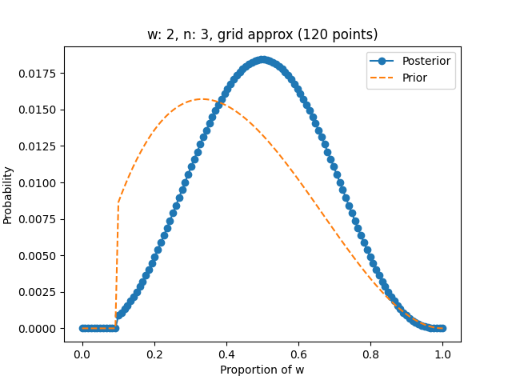
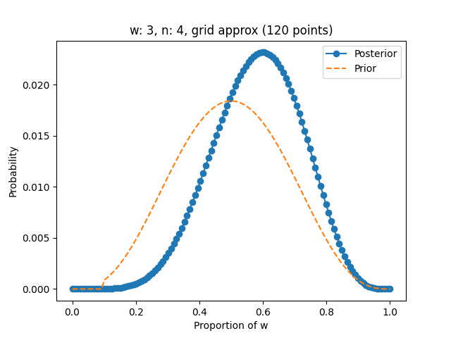
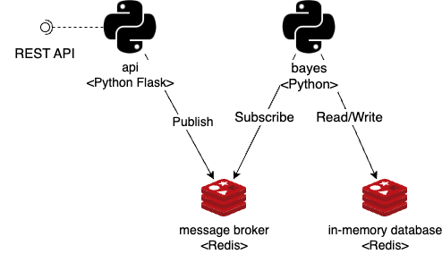
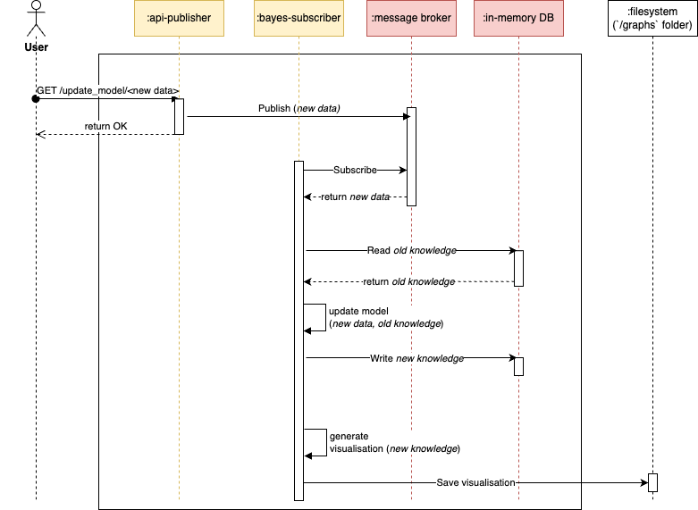

# event-driven-python
## About the project
Event driven microservice architecture build in Python.

First microservice (`api`) implements Flask API that publish events on Redis message broker.  
Second microservice (`bayes`), a subscriber, uses events to incrementally (time and space complexity are O(1)) update  
(new prior = old posterior distribution) Bayesian Binomial model using grid approximation and visualise prior and posterior distributions of data.




This project was inspired by the following books:
- Statistical Rethinking 2nd edition by Richard McElreath ([materials](https://xcelab.net/rm/statistical-rethinking/))
- Architecture Patterns with Python by Harry Percival and Bob Gregory ([code repository](https://github.com/cosmicpython/code))
- Clean Architecture by Robert Martin


## Software architecture
The following deployment diagram shows components.



The following sequence diagram shows communication between entities.




## Software design

Project follows **clean** architecture and SOLID principles. In short, high-level modules (business rules) 
do not depend on low-level ones (database, UI, API).  
It consists of **domain**, **application service** and **infrastructure** layers.

Project follows **testing pyramid** framework from **test driven development** approach.  
It consists of **unit**, **integration** and **end-to-end** tests.

Project follows **repository pattern** and **service layer pattern** design patterns  
from **domain driven design** approach.


# Development setup

## Local
Command `docker-compose build` builds Docker image.  
Command `docker-compose up bayes-subscriber` starts the `bayes` microservice.  
Command `docker-compose up api-publisher` starts the `api` microservice.  
Command `docker-compose up jupyter` start Jupyter Notebook on `http://localhost:8888/lab`.

Visualisations are generated in `/graphs` folder.

## Running checks and tests

To run **all** checks and tests, execute:

```shell
docker-compose run --rm --entrypoint ./entrypoint.sh bayes-subscriber test local
```


## API
Once `api` microservice is started, API is available on the following URLs:
```shell
http://localhost:8000/update_model/w
http://localhost:8000/update_model/l
```
REST API accepts values `w` and `l` for updating Bayesian Binomial model.


## Redis in-memory database / message broker

Redis in-memory database is being used for storing model's knowledge (two values) by `bayes` microservice.
Redis is also being used as a message broker.  
Messages can also be published manually with the following commands:

```shell
# Use redis-cli inside Docker container
docker exec -it event-driven-python-redis redis-cli
# Set Redis so that does not store data on drive
config set stop-writes-on-bgsave-error no
# Publish message `w` on channel `update_model`
PUBLISH update_model w
```


# Integration with PyCharm

## Configure the project interpreter

1. Go to **Settings / Project / Project Interpreter**
2. Click on the button on the bottom right to add a new one
3. Select **Docker compose** from the list of environments
4. Select the service **api-publisher**/**bayes-subscriber** and press **OK**

## Configure Flask server (`api` microservice)

1. Add a new Run/Debug configuration in the menu **Run / Edit Configurations...**
using the template **Flask server**
2. Specify `api/main.py` as **Target**
3. Specify `server` (the name of the variable in `main.py`) as **Application**
4. Specify `--host=0.0.0.0 --port=8000` as **Additional options**
5. Enable **FLASK_DEBUG** (optional)
6. Select the Python interpreter created in **configure the project interpreter**


## Configure Python program (`bayes` microservice)

1. Add a new Run/Debug configuration in the menu **Run / Edit Configurations...**
using the template **Flask server**
2. Specify `bayes/main.py` as **Script**
3. Set **Working directory** to `event-driven-python` folder.
4. Select the Python interpreter created in **configure the project interpreter**

## Configure Pytest tests

1. Add a new Run/Debug configuration in the menu **Run / Edit Configurations...**
using the template **Python tests/pytest**
2. Specify `tests` folder as **Module name**
3. Specify `--no-cov --numprocesses auto` as **Additional Arguments** (optional)
4. Select the Python interpreter created in **configure the project interpreter**
